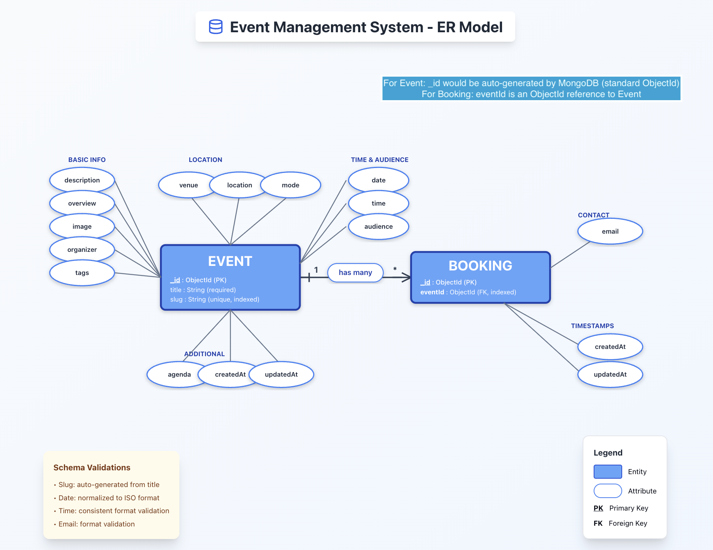
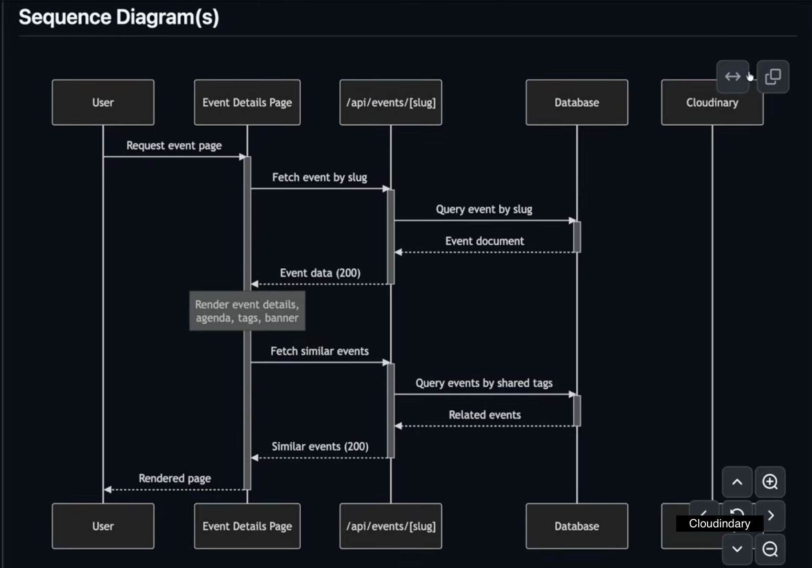
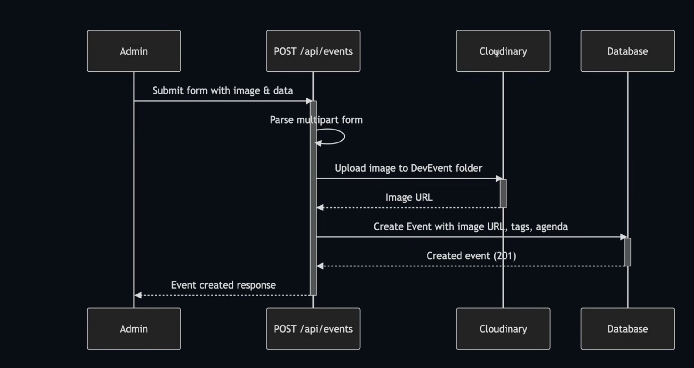
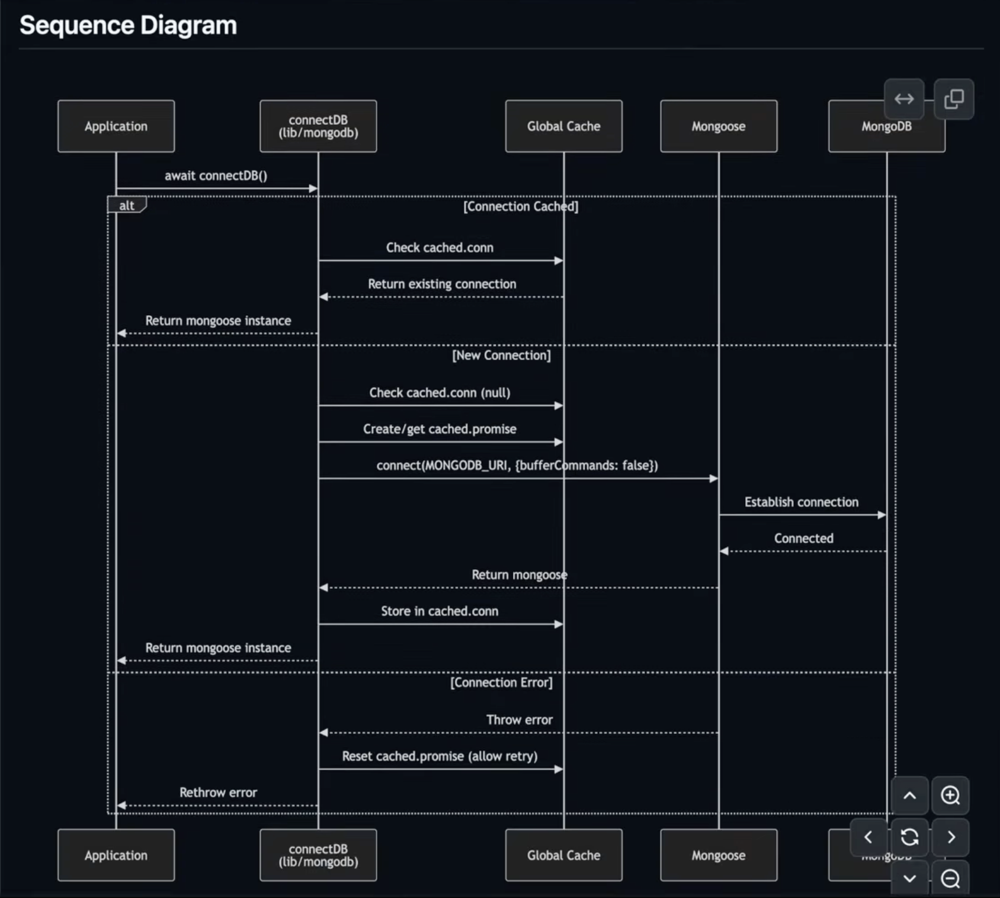
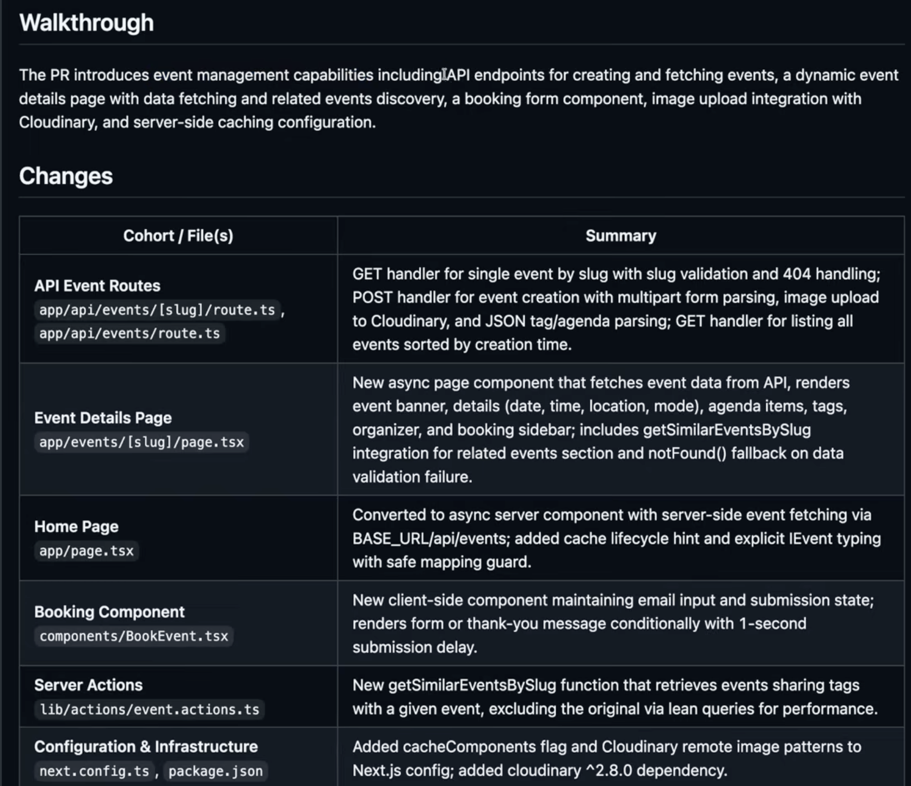
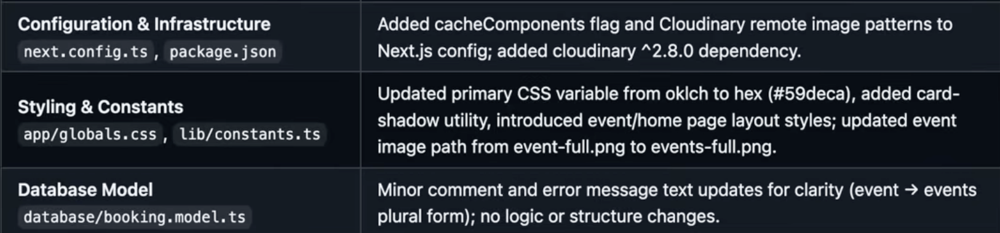

# Dev Events 🎯
A Full-Stack Developer Events Discovery & Booking Platform

## 📌 Overview
Dev Events is a full-stack web application built to help developers discover tech events such as hackathons, meetups, and conferences, and register for them seamlessly. The platform focuses on clean architecture, performance optimization, and real-world product concerns like caching, analytics, and maintainability.

This project was built end-to-end using modern web engineering practices and reflects a production-oriented approach rather than a demo or tutorial project.

---

## 🏛️ Architecture

This project follows a **serverless-oriented monolithic architecture** using Next.js App Router.

The frontend and backend live in a single codebase, while API routes and server actions execute as stateless serverless functions. This approach enables fast iteration, simplified deployment, and scalable request-based execution without introducing microservice complexity.


## ✨ Features
- 🔍 **Event Discovery** – Browse a curated list of developer events
- 🧭 **Dynamic Event Pages** – SEO-friendly, slug-based event detail pages
- 📩 **Email-Based Registration** – Simple and fast event booking flow
- ⚡ **Performance Optimization** – Server-side caching and controlled revalidation
- 📊 **Analytics & Observability** – Track meaningful user interactions
- 🧩 **Modular Architecture** – Clean separation of UI, backend logic, and data models

---

📌 **ER Diagram:**  


#### Event
- `_id` (ObjectId, PK – auto-generated by MongoDB)
- `title` (string, required)
- `slug` (string, unique, indexed)
- `description`, `overview`
- `image` (Cloudinary URL)
- `organizer`
- `tags` (array)
- `agenda` (array)
- `date`, `time`, `audience`
- `venue`, `location`, `mode`
- `createdAt`, `updatedAt`

#### Booking
- `_id` (ObjectId, PK)
- `eventId` (ObjectId, FK → Event)
- `email`
- `createdAt`, `updatedAt`

**Relationship:**  
One `Event` → many `Bookings`

Schema-level validations ensure:
- auto-generated slugs
- normalized date formats
- consistent time formats
- valid email addresses

---
## 🔄 API & Backend Workflows

### 2. Event Creation Flow (Admin → API → Cloudinary → DB)

📌 **API Route Flow Diagram:**  


#### Flow Summary:
1. Admin submits a multipart form containing image + event metadata
2. `POST /api/events` parses the multipart request
3. Image is uploaded to a dedicated Cloudinary folder
4. Cloudinary returns a secure image URL
5. Event is created in MongoDB using the image URL, tags, and agenda
6. API returns a `201 Created` response

This flow ensures:
- clean separation of concerns
- reliable media handling
- consistent event creation logic

---

### 3. Event Fetching & Details Page Flow

📌 **Event Details Sequence Diagram:**  


#### Flow Summary:
1. User navigates to `/events/[slug]`
2. Server component fetches event data via `GET /api/events/[slug]`
3. Event is queried using indexed `slug`
4. Event details are rendered server-side
5. A secondary query fetches similar events using shared tags
6. Fully rendered page is returned to the user

This design enables:
- fast server-side rendering
- predictable data fetching
- graceful `404` handling using `notFound()`

---

## 🧠 Database Connection & Caching Strategy

📌 **Database Connection Lifecycle Diagram:**  


### MongoDB Connection Optimization
- Uses a **global cached connection**
- Prevents multiple DB connections during hot reloads
- Handles:
    - cached connections
    - in-progress connection promises
    - safe retries on failure

This pattern is critical for:
- Next.js server environments
- preventing connection exhaustion
- improving backend stability

---

## ⚡ Caching & Performance Strategy

- Home page uses **hour-level cache lifecycle hints**
- Event detail pages use **controlled revalidation**
- Redundant database queries are avoided
- Server Actions reduce unnecessary client-server roundtrips

Result:
- Faster page loads
- Lower DB pressure
- Predictable performance under increased traffic

---

## 🛠️ Tech Stack

### Frontend
- **Next.js (App Router)**
- **React**
- **TypeScript**
- **Tailwind CSS**

### Backend
- **Next.js API Routes**
- **Server Actions**
- **MongoDB & Mongoose**

### Analytics & Tooling
- **PostHog** (user interaction tracking)
- **Server-side caching & revalidation**
- **Shadcn/UI configuration**

---

## 🏗️ Architecture Highlights
- Uses **App Router** with server-first rendering patterns
- Implements **server actions** to reduce client-server overhead
- Employs **hour-level caching** to improve performance and reduce database load
- Separates concerns across components, routes, actions, and models
- Designed for easy extension (authentication, event creation, admin flows)

---

## 📊 Analytics Events Tracked
The application tracks **10+ meaningful user interactions**, including:
- Event card clicks
- CTA interactions
- Navigation clicks
- Event booking submissions
- Error scenarios

Analytics are used to:
- understand user behavior
- identify friction points
- support data-driven iteration

---
## 🧪 Feature Walkthrough & Code Changes

📌 **Implementation Summary Table:**  
  


## 🧠 Key Learnings
- Designing end-to-end systems instead of isolated features
- Making performance-conscious decisions early (caching, revalidation)
- Structuring scalable backend workflows with server actions
- Instrumenting analytics to observe real user behavior
- Writing clean, maintainable code aligned with production standards

---

### Key Additions
- REST API routes for event creation and fetching
- Dynamic event detail page with related events
- Booking component with client-side state handling
- Server actions for fetching similar events
- Cloudinary integration for image uploads
- Cache configuration in Next.js
- Clean styling and constants refactor
- MongoDB schema clarity improvements

---

## 🚀 Getting Started

### Prerequisites
- Node.js (v18+)
- MongoDB instance (local or cloud)
- npm / yarn / pnpm

### Installation
```bash
git clone https://github.com/your-username/dev-events.git
cd dev-events
npm install
````
### Environment Variables
***Create a .env.local file and add:***
```bash
MONGODB_URI=your_mongodb_connection_string
NEXT_PUBLIC_BASE_URL=http://localhost:3000
NEXT_PUBLIC_POSTHOG_KEY=your_posthog_key
NEXT_PUBLIC_POSTHOG_HOST=your_posthog_host
````
***Run Locally***
```bash
npm run dev
````

## To see how it'll look click on ->
```bash 
    https://dev-event-cde27rhx5-khushis-projects-ea0259c2.vercel.app/
```
